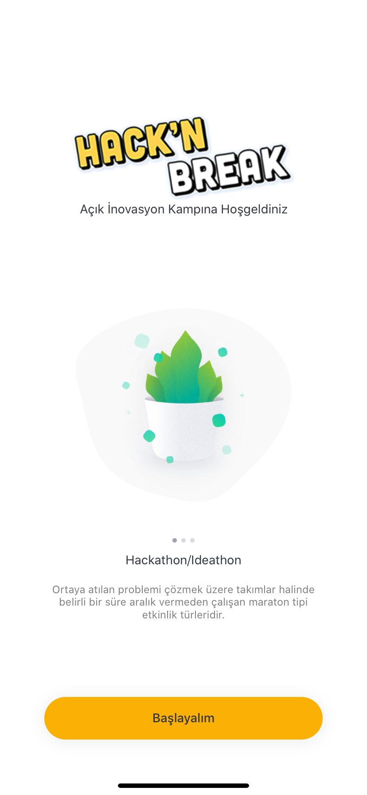
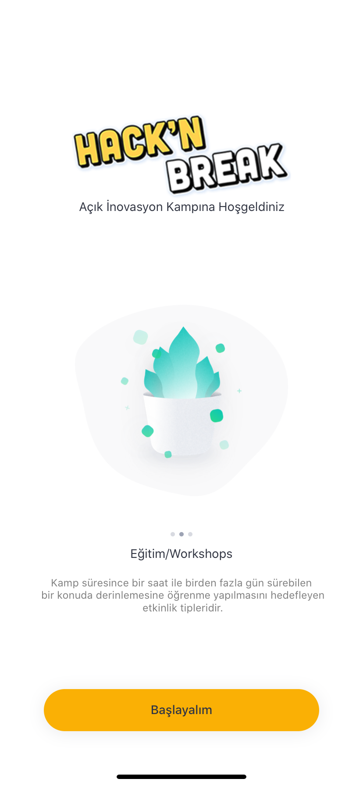
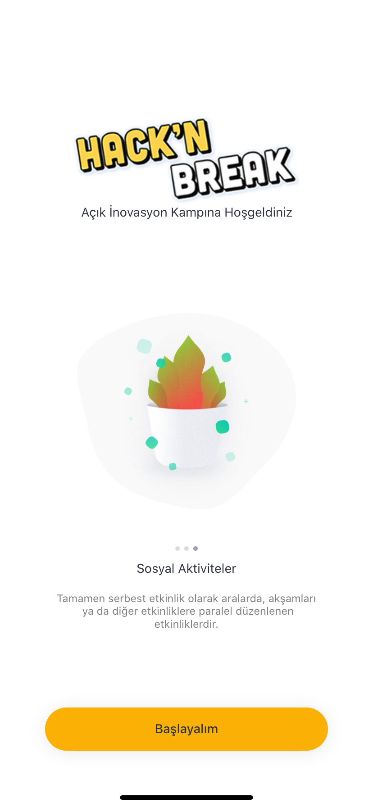
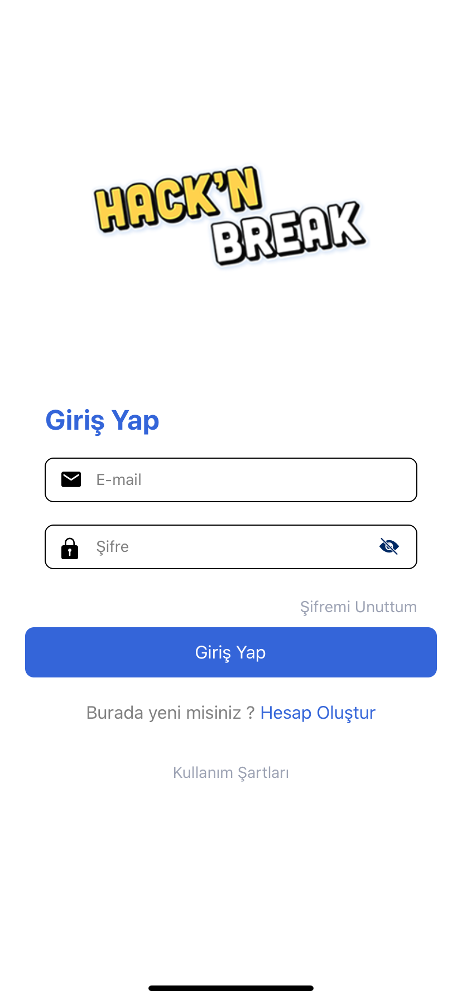
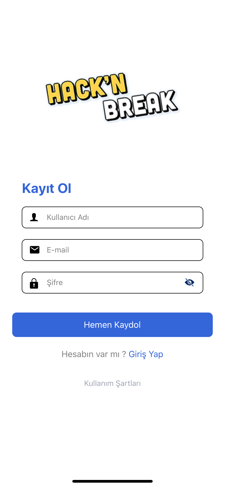
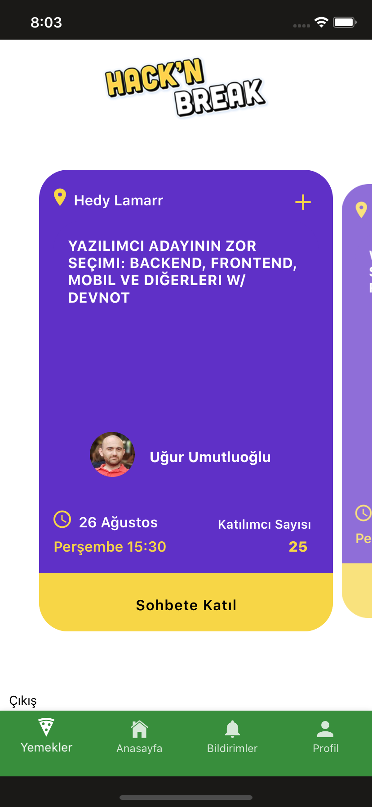
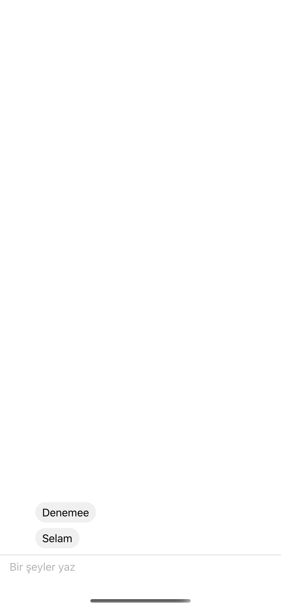
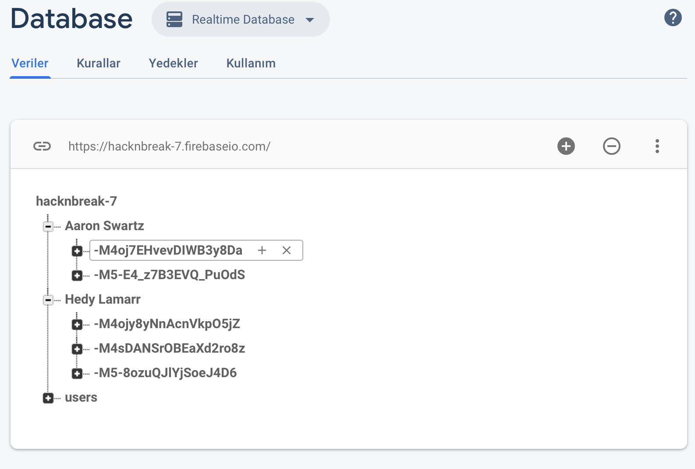

> Heyy! Hacknbreak uygulamasını geliştirmek için gönüllü yazılımcı ve tasarımcılar arıyoruz!

    <tr>
    
   
        </tr>

Açık kaynak kodlu bu projeye katkıda bulunanları, yalnızca kod değil her türlü katkıyı tanıtmak için yapılmış bir sayfadır.

## Katkıda Bulunanlar Tablosu ✨
Bu harika insanlara teşekkürler

<!-- ALL-CONTRIBUTORS-LIST:START - Do not remove or modify this section -->
<!-- prettier-ignore-start -->
<!-- markdownlint-disable -->

## Yapılacaklar;
Şifremi unuttum safyası tasarım ve kodlama

Kullanım şartları tasarımı ve içeriği

Seçilen etkinlikleri telefonun takvimine ekleme kodlaması

Anasayfa etkinlik kartları tasarım

Bildirim (Seçilen etkinliklerin gösterildiği) sayfası tasarım ve kodlaması

Yemek listesi tasarım ve kodlaması

Çıkış Butonunun nereye saklanacağı

Etkinlik kartında katılımcı sayısının kodlaması

Backend tarafında bütün Konuşmacıların listesini JSON formatına çevirme

JSON formatında olan listeyi güncel tarih saat ile karşılaştırıp en güncel olanı ilk sıraya getirme backend kodlaması

Sohbet (Chat ekranı) sayfasının tasarımı ve kodlanması

Seçilen ve yaklaşan etkinliğin bildirim olarak kullanıcıya gönderilmesi

<table>
  <tr>
    <td align="center"><a href="https://muratseven.com.tr"> <b>Murat Seven</b></a> <a href="#" title="Soruları Yanıtlama">💬</a> <a href="https://github.com/all-contributors/all-contributors/commits?author=MatheusRV" title="Code">💻</a> <a href="#" title="Kodları İnceleme">👀</a> <a href="#" title="Duyuru">📢</a></td>
    <td align="center"><a href="https://github.com/BayCem"> <b>Cem Tunçelli</b></a>  <a href="https://github.com/all-contributors/all-contributors/commits?author=MatheusRV" title="Code">💻</a><a href="#" title="Kodları İnceleme">👀</a></td>
    <td align="center"><a href="https://github.com/mukireus"> <b>Muhammet Ömer</b></a>    <a href="#design-marcobiedermann" title="Tasarım">🎨</a></td>
    <td align="center"><a href="https://github.com/judix"> <b>Abdurrahman Tekir</b></a> <a href="#" title="Tasarım">🎨</a> </td>
    <td align="center"><a href="https://github.com/Nedim-Sahin"> <b>Nedim Şahin</b></a> <a href="#ideas-KirstieJane" title="Fikir ve Geri Bildirim">🤔</a></td>

  </tr>

</table>

<!-- markdownlint-enable -->
<!-- prettier-ignore-end -->
<!-- ALL-CONTRIBUTORS-LIST:END -->

## LICENSE

[MIT](LICENSE)
